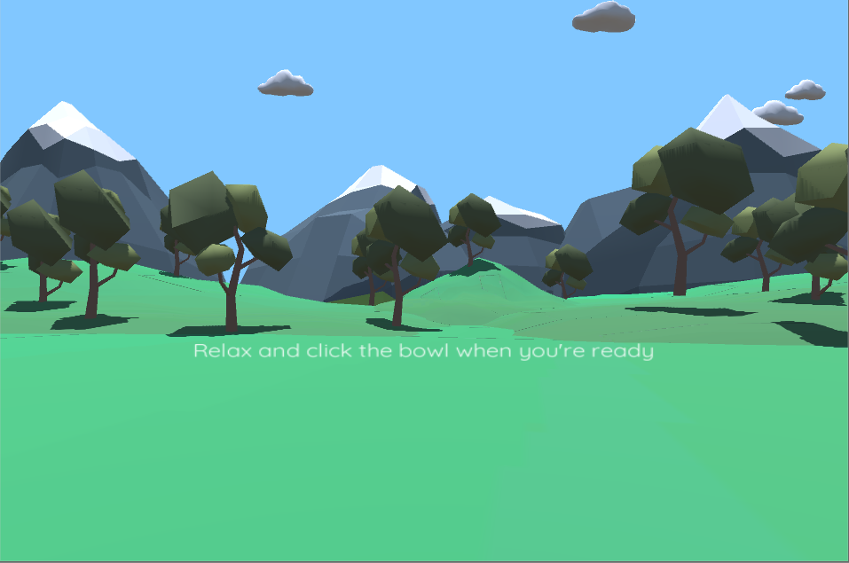
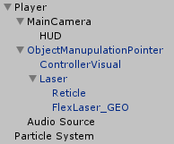
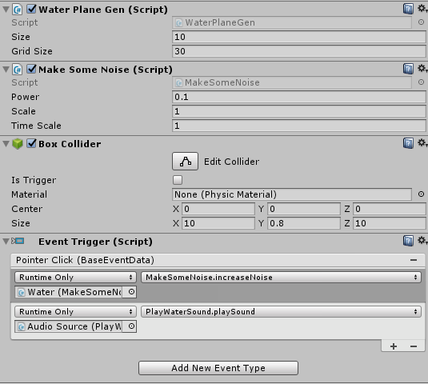
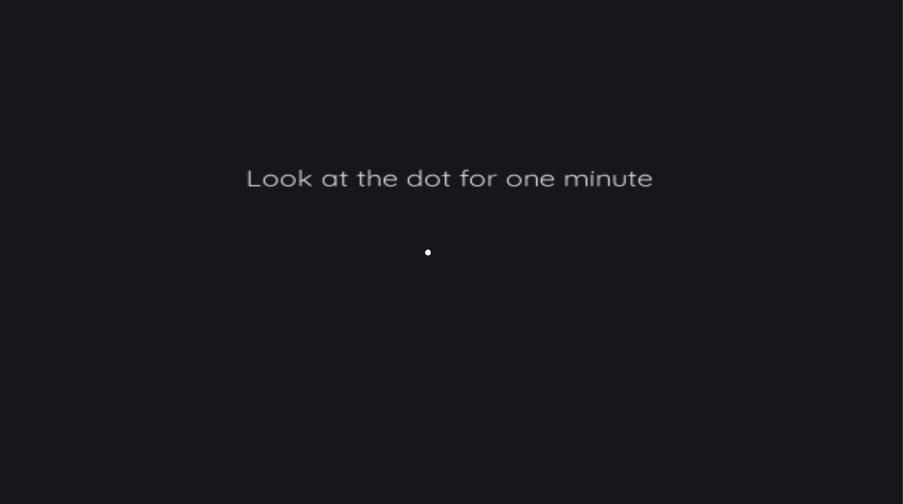

# Mindful: a VR meditation experience
The purpose of Mindful is to create an immersive experience using virtual reality to practice mindfulness habits. The use of virtual reality allows for the user to be present in a calming environment, free of outside factors. The application also guides the user through different meditation techniques, and will be an effective tool to educate users on mindfulness and meditation practices.

[Video Demo](https://www.youtube.com/watch?time_continue=29&v=K1y6A8I5S-0)
[Test this app](https://docs.google.com/spreadsheets/d/1_EfxZEP15vrj7mj-7cmF-nl7xJMHLXjRWsPdNN-H1cs/edit?usp=sharing)

## Overview
In addition to the primary purpose of providing a mindful environment in virtual reality, a major purpose of the application is to educate users on meditation and mindfulness practices that can be applied in everyday life. Through the application, users will be guided through meditation, including practicing correct posture, and learn different well-known techniques.

## Platform
The application is targeted at VR platforms, such as Google Cardboard and the Oculus Rift. To make Mindful a more accessible application, the project is currently aimed at Google Daydream, with plans to extend it to Cardboard.

## Tools
The project will be primarily implemented using Unity. Sketch, a user interface tool, will be used to plan the visual design of the application. Most of the model assets will be obtained from [Google Poly](https://poly.google.com/). Other assets will be required, such as sound and possibly voice-over audio. Attributions for these will be made available as assets are obtained, where applicable.

(Google VR SDK for Unity)[https://developers.google.com/vr/develop/unity/get-started-android]

(Daydream Elements for Unity)[https://developers.google.com/vr/elements/overview]

(Airdroid)[https://www.airdroid.com/] (for those of you wondering how I screen mirrored this)

## Scenes
### Peaceful Meadow
This is the entry point for users. This scene is meant to provide a pleasant place for the user to unwind and relax before moving on to the exercises. It has a simple and colorful low-poly aesthetic that is easy on the eyes and plays calming ambient sound.

Peaceful landscape of rolling hills, trees, and snow covered mountains

125 different shapes randomly generated and blowing gently through the sky

Small pool of water with stones in it. Users may click the water to play a sound effect and make the waves larger.

To continue to the meditation exercises, user click this bowl and are transfered to a new scene.

### Meditation
This scene houses both of our simple meditation and mindfulness techniques. The color used for the environment is called "Eigengrau" (#16161D) and is the color we normally see when we close our eyes. The following two exercises are meant to relax the user and allow them to focus on mindfulness.

#### Focus

The focus exercise aims to teach users about one of the core mindfulness principles: detatching from inner thoughts and practicing mental stillness. As the quote explains at the beginning of the exercise, consciously focusing on a single point is one way to directly focus on something in the present and exist outside of one's thoughts. This principle can be expanded upon to teach users about some of the most important mindfulness habits: using stimuli from the outside world to focus oneself outward instead of inward, and being consciously aware of things around them.

#### Deep Breathing

By itself, practicing elongated breathing has been shown to reduce stress and pain sensitivity, and has been linked to a reduction in negative emotions such as anger and anxiety. In mindfulness practice, breathing is a common sensation to concentrate on, a similar role to the focus dot in the previous exercise. By concentrating on controlling one's breath, a person has both less tendency to be lost in thoughts and, when thoughts arise, has something to concentrate on to shift focus away from the thoughts. By providing a diagram in the deep breathing exercise to syncronize breathing with, the application is able to help users practice controlling their breathing.

## Implementation
### Player

- Empty player object containing scripts to move the player when necessary
  - MainCamera is the camera for the scene and recognized as the head by GoogleVR
    - The Heads Up Display (HUD) is a text window positioned in front of the camera to send messages to the player
  - OjectManipulationPointer contains all the control scripts for the Daydream Controller
    - ControllerVisual is just what it sounds like
    - Laser contains a raycaster and the the reticle
      -Reticle sits at the end of the raycaster to visually show selections
      - FlexLaser_GEO is the special laser used for ObjectManipulationPointer
  - Audio Source on the player is used for ambient noises
- (Particle system just somehow made it into the picture, it's not part of player)

### VR Interactions

The water shown here is an example of an interactive object. For Daydream apps, interactive objects require at minimum the following two elements:
1. A collider - This is what the raycaster is able to point to in order to select the object.
2. An event trigger - This allows the item to make function calls in the scene, in this instance, when the pointer is clicked the noise of the water increases and a random water sound is played.

Scripts used by the event trigger may be on other objects, for instance PlayWaterSound was not on the triggering object in this instance, it came from a separate audio source object.

### Focus

The focus exercise is easy to implement. Using a coroutine, a focus object given to the script was cloned and moved with the player out of rendering distance of the menues. Then messages are sent to the HUD to instruct the player on what to do. Once the exercise is over, the player and object return to their normal spaces.

### Deep Breathing

The deep breathing exercise is similar to the focus exercise. It uses a coroutine to take an object and a background (a blue and a white sphere respectively) and moves them and the player far away from the menu. The spheres line up with the background behind the focus. The Background is scaled up to be larger than the focus. The focus updates every frame to either enlarge or shrink, alternating when it reaches its full size and once it reaches less than it's initial size.

## Division of Labor
Scott Blechman: Visual design, project structure, environment modeling

Fox Bolduc: Software design and implementation
