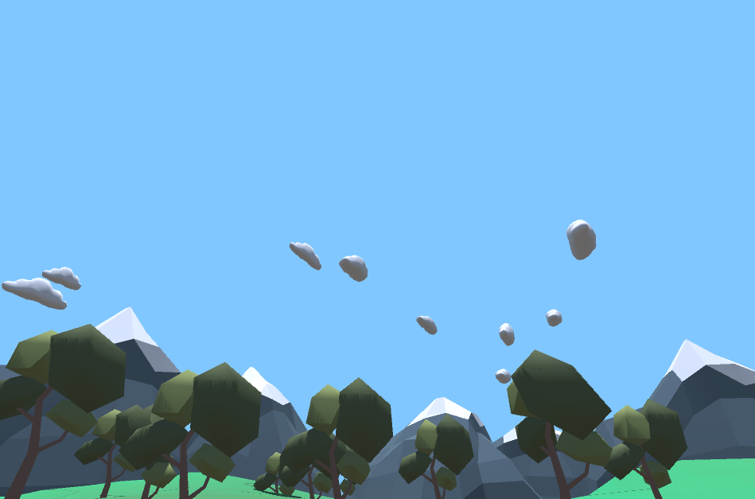
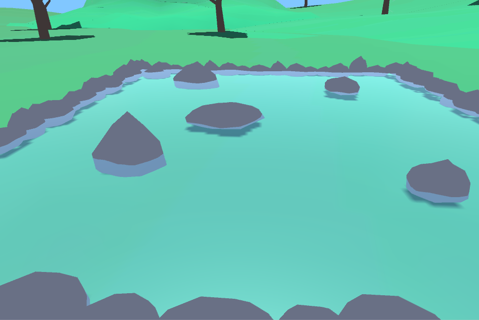
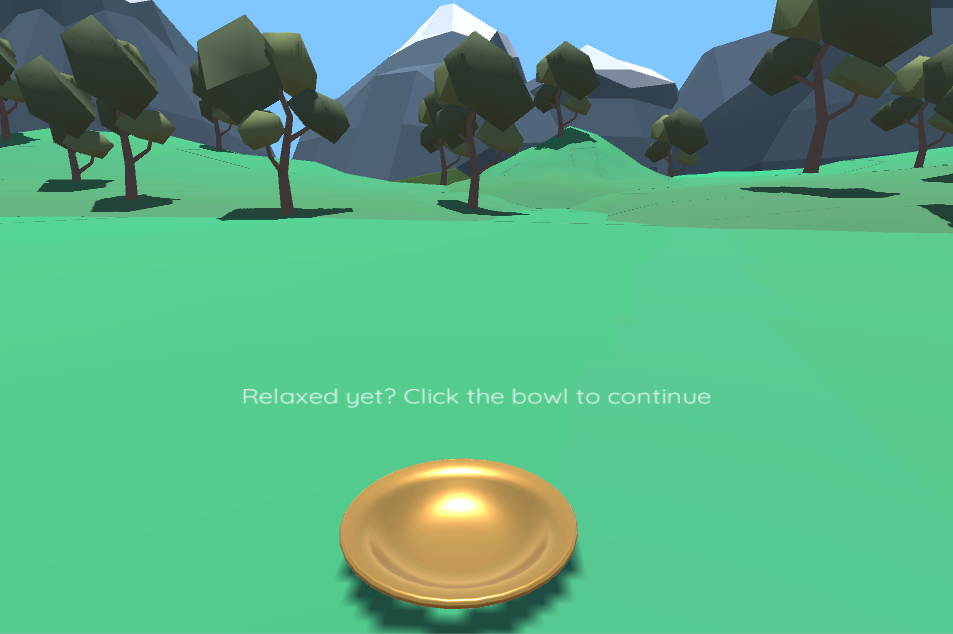
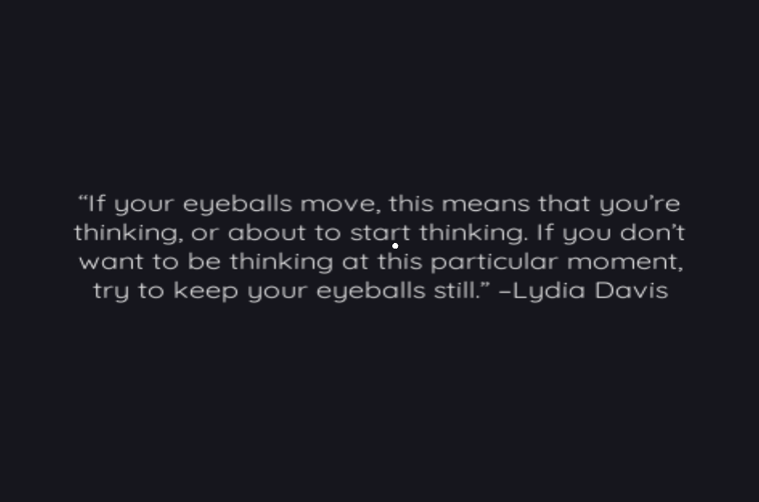
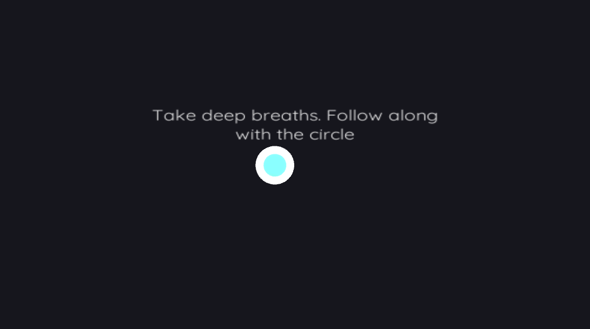

# Mindful: a VR meditation experience
The purpose of Mindful is to create an immersive experience using virtual reality to practice mindfulness habits. The use of virtual reality allows for the user to be present in a calming environment, free of outside factors. The application also guides the user through different meditation techniques, and will be an effective tool to educate users on mindfulness and meditation practices.

## Video Demo

## Overview
In addition to the primary purpose of providing a mindful environment in virtual reality, a major purpose of the application is to educate users on meditation and mindfulness practices that can be applied in everyday life. Through the application, users will be guided through meditation, including practicing correct posture, and learn different well-known techniques.

## Platform
The application is targeted at VR platforms, such as Google Cardboard and the Oculus Rift. To make Mindful a more accessible application, the project is currently aimed at Google Daydream, with plans to extend it to Cardboard.

## Tools
The project will be primarily implemented using Unity. Sketch, a user interface tool, will be used to plan the visual design of the application. Most of the model assets will be obtained from [Google Poly](https://poly.google.com/). Other assets will be required, such as sound and possibly voice-over audio. Attributions for these will be made available as assets are obtained, where applicable.

## Scenes
### Peaceful Meadow
This is the entry point for users. This scene is meant to provide a pleasant place for the user to unwind and relax before moving on to the exercises. It has a simple and colorful low-poly aesthetic that is easy on the eyes and plays calming ambient sound.

Peaceful landscape of rolling hills, trees, and snow covered mountains

125 different shapes randomly generated and blowing gently through the sky

Small pool of water with stones in it. Users may click the water to play a sound effect and make the waves larger.

To continue to the meditation exercises, user click this bowl and are transfered to a new scene.

### Meditation
This scene houses both of our simple meditation and mindfulness techniques. The color used for the environment is called "Eigengrau" (#16161D) and is the color we normally see when we close our eyes. The following two exercises are meant to relax the user and allow them to focus on mindfulness.

#### Focus

The focus exercise aims to teach users about one of the core mindfulness principles: detatching from inner thoughts and practicing mental stillness. As the quote explains at the beginning of the exercise, consciously focusing on a single point is one way to directly focus on something in the present and exist outside of one's thoughts. This principle can be expanded upon to teach users about some of the most important mindfulness habits: using stimuli from the outside world to focus oneself outward instead of inward, and being consciously aware of things around them.

#### Deep Breathing

(Scott, again tell them why this works)

## Implementation
### Player

### VR Interactions

### Focus

### Deep Breathing
## Division of Labor
Scott Blechman: Visual design, project structure, environment modeling

Fox Bolduc: Software design and implementation
